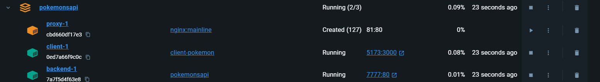
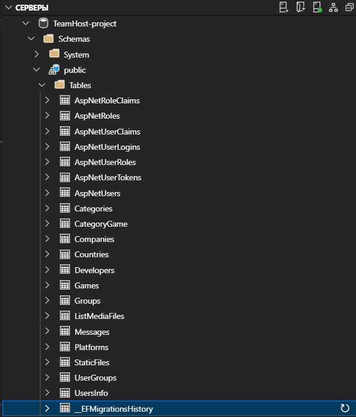
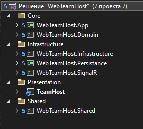

# Домашние работы по ОРИСу 

## 1-2/Pokemon
- Создан React App приложение, там используются компоненты и сделан сайт по покемонам, а также задеплоен
### Pokemons
- ссылка на репозиторий [MyGitHub/Pokemons](https://github.com/foreverestBulat/Pokemons) 
- Deploy [Pokemons](https://foreverestbulat.github.io/Pokemons/)

## 3-4/Pokemon
- Создан проект ASP.NET MVC API с своей реализацией API для покемонов
- Создан Frontend на Vue js и реалтзован
- PokeAPI используется для заполнения бд
- Созданы Dockerfile для API, Frontend и nginx
- Создан docker-compose с контейнерами для API, Frontend и nginx
- тестирование: запуская docker-compose работает Front и API, но я не сумел сделать nginx для привязки между ними
- 

## (5-11)/Teamhost

## Если не открываются то вот ссылки рабочие
### TeamHost
- ссылка [TeamHost-Architecture](https://github.com/foreverestBulat/TeamHost-Architecture) 
- ссылка [TeamHost.WEB](https://github.com/foreverestBulat/TeamHost.WEB)

- архитектура в Teamhost(5-11)/TeamHost-Architecture
- Web в Teamhost(5-11)/TeamHost.WEB/TeamHost
- они разделены так я создал TeamHost.WEB по другому пути у себя на компьюторе, а в решении WEB использую как ссылку на проект
- Homework 5
    - Создание проект ASP.NET MVC 
    - Котроллеры
        - Размещение контента страниц в Areas
    - Макеты
        - Перенесены в Areas/{Controller}/Views
    - Маршрутизация работает корректно

- Homework 6
    - Teamhost-Architecture/WebTeamHost.Domain/Entities
        - Все нужные на мой взгляд сущности реализованы для страниц Store, Game/{id},  Profile, Chats
    - добавление DbContext через Dependency Injection в програм program.cs есть `using WebTeamHost.Persistance.Extensions;`
    - Миграции есть в Persistance/Migrtions и они применены
    -  Скриншот из Azure Data Studio. 
    - Использовал PostgreSQL в качестве бд

- Homework 7
    - Архитектура, слои:
        - 
        - Core
            - Application (App)
                - App/Interfaces/ Интерфейсы репозиторий определяют какие должны быть функции для каждой сущности
                - App/Features/ Функции create, update и delete для некоторых сущностей (для всех было лень делать), также query запросы для WEB.
            - Domain
                - Common/ абстрактные классы которые наследует каждая сущность
                - Entities/ Сущности перенесены сюда
        - Infrastructure
            - Infrastructure
                - Сервисы
            - Persistance (знаю что правильно Persistence, но уже поздно Visual studio не способен изменить везде namespace)
                - Здесь DbContext проекта Teamhost
        - Shared
            - Shared
                - классы Result, всегда получает в ответ контроллер, когда делает запрос в mediator

        - Presentation
            - проект WEB
                - Extensions 
                    - в App, Infrastructure, Persistance в каждом из них есть папка Extensions и там класс IServiceCollectionExtensions для подключения их в WEB через Dependency Injection
                - каждый(наверно) контроллер вместо использования DbContext отправляет запросы через mediator

- Homework 8
    - Identity
        - Макеты 
            - использовал шаблоны Teamhost
        - DbContext
            - наследует IdentityDbContext, для использования IdentityUser
            - в Entities User наслудует IdentityUser
            - Использованы аттрибуты и fluent api(минимально) для Entity, для настройки бд
    - WEB
        - AccountController
            - Реализация входа и регистрации в котроллере Account
            - использован аттрибут Authorize, для ограничения доступа(кроме страниц Login и Register)
        - Header
            - показывает информацию о пользователе если он авторизован иначе ссылка на Login

- Homework 9
    - SignalR
        - Entities
            Есть сущности Group, Message, UserGroup(для связи many-to-many)        
        - создал как отдельный проект для SignalR(видимо зря, надо было в WEB)
        - ChatHub
            - создал два метода ConnectToGroup и Send
            - ConnectToGroup при открытии страницы чатов сразу отправляется запрос в ChatHub, который принимает ConnectToGroup и создает Connect с группой которой есть в бд в данном случае, самая первая группа которая есть у пользователя является дефолтной. Группы можно выбирать.
        - Send принимает сообщение и создает экземпляр сущности Message и сохраняет его в бд для данной группы
        - Обновление интерфейса
            - в странице чатов есть js скрипт, который как отрабатывает отправку и принимание новых сообщений

- Homework 10
    - Redis
        - Интерфейсы
            - для интерфейса IGenericRepository в App добавил новый метод GetFromCacheById, который реализован в Persistance в GenericRepository
            - GetFromCacheById
                - Он берет данные из кэша по id, если нашел то возращает, иначе если его нет то ищет в бд если нашел в бд то его добавляет в кэш и возращает его
        - Тестирование
            - как я понял у меня почему то Windows 10 Pro не совместим с docker, поэтому никак не проверял как работает.

- Homework 11
    - Deploy

- Также были домашки
    - Локализация
        - почти для всех страниц реализована локализация на языки Русского, Английского и Тайского
        - в папке WEB/TeamHost/Localizer есть папка Resources для каждой области есть файлы .resx которые хранят текст для каждого языка
        - в Views есть `@using Microsoft.AspNetCore.Mvc.Localization; @inject IViewLocalizer Localizer` и для каждой нужной фразы используется `@Localizer["{name}"]`
        